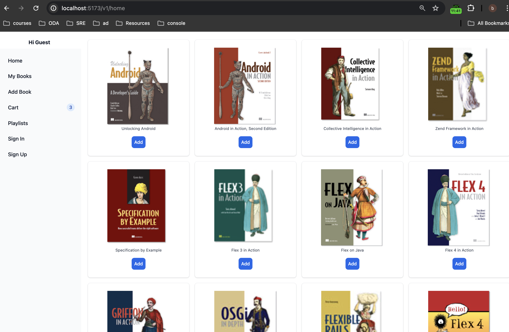
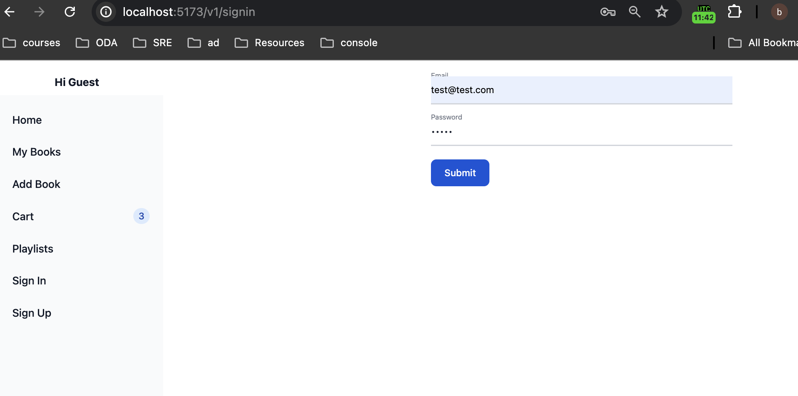
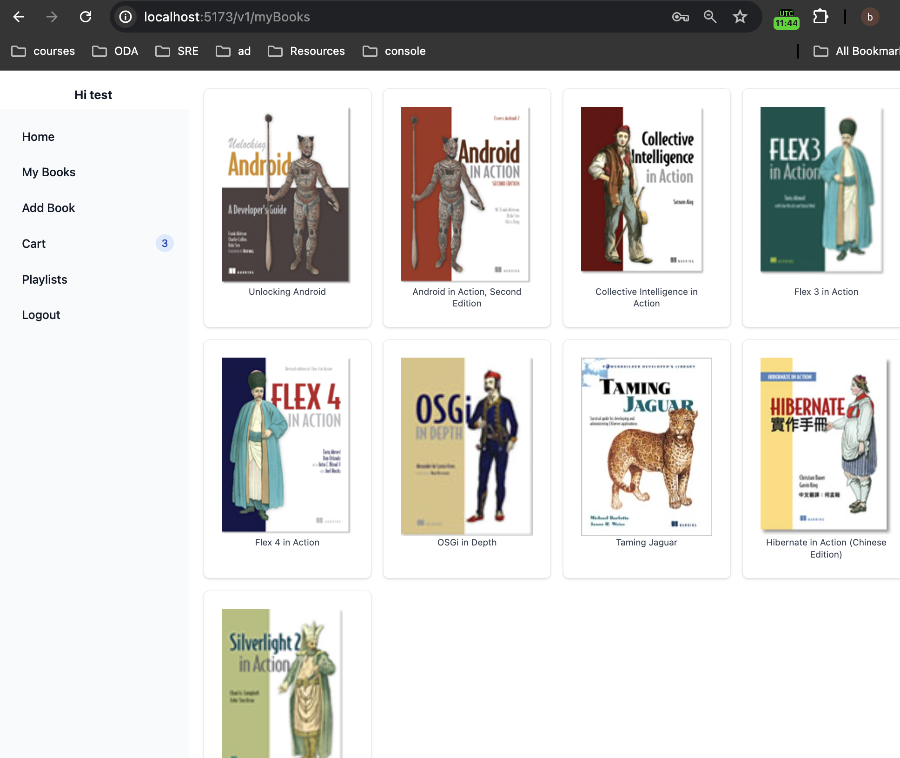

# online-bookstore

in backend change .env.example to .env and add the contents for POSTGRESQL user, password and db names

In POSTGRESQL DB, we need to add tables for users, books and user_book. commands in create_tables.txt

To start server and client, change directory to backend and frontend in seperate terminals are run
### `npm run dev`

To add books to the Page, run initial_addBooks.py script
### `python3 initial_addBooks.py`

You should be able to access the page on 
### `http://localhost:5173/v1/home`

## Tech Stack

Nodejs, React, PostgreSql, express, passport

##Pages

### HomePage

### SignIn Page

### MyBooks Page

### Book Page

